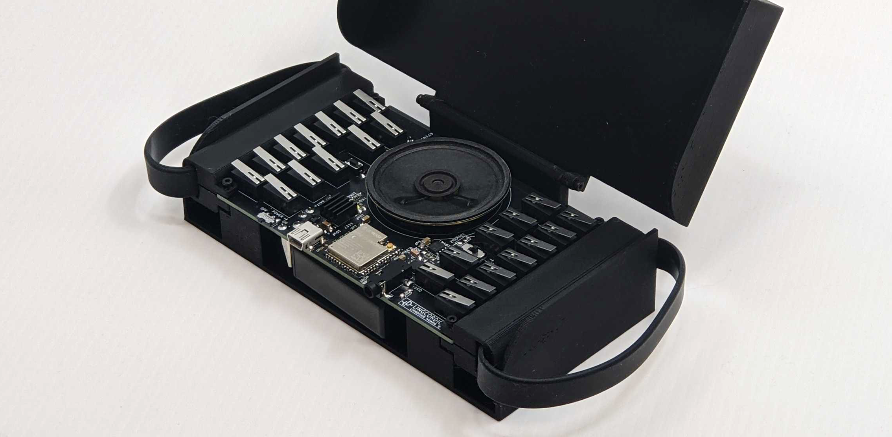
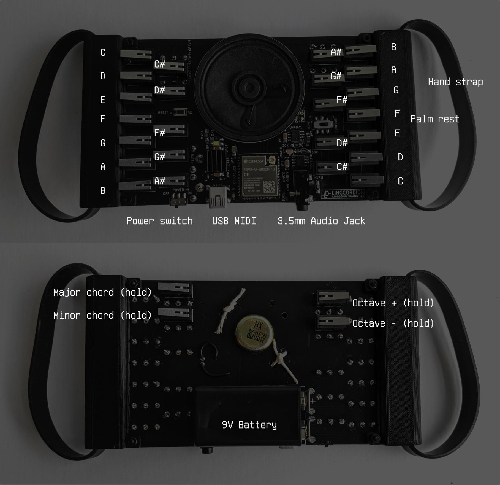

# Lingcordion

A pocket-sized digital musical instrument inspired by the piano and the accordion.

This repo hosts the design files of the PCB, source code for the firmware, and CAD parts for 3D printing.

## Features

- 3 playable octaves on the right hand, bass/chord mode on the left hand.
- On-board synthesizer / MIDI output (USB).
- On-board speaker / 3.5mm audio jack.
- Easy to learn, fits in your back pocket.

## How to Play

[Here's a video of me playing the instrument.](doc/v01.mp4)

https://github.com/user-attachments/assets/264b68fd-24f3-4782-8792-03d39f5a074a

## BOM

- 28 limit switches
- ESP32-S3 module with more than 4 MB of flash
- LM4871 for audio power amplifier
- MCP4921 for DAC
- Assorted 1206 resistors capacitors. Misc. buttons and switches. 1117 3.3V regulator.
